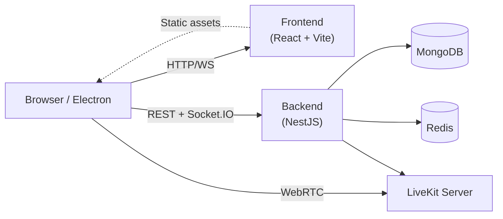

# Architecture Overview

Kraken is a self-hosted Discord-like communication platform with real-time messaging, voice/video calls, and community management.

## System Architecture



## Communication Patterns

| Protocol | Technology | Purpose |
|----------|-----------|---------|
| **REST** | OpenAPI-generated client | CRUD operations, auth, file uploads |
| **WebSocket** | Socket.IO + Redis adapter | Real-time events (messages, presence, notifications) |
| **WebRTC** | LiveKit | Voice, video, screen sharing |

### REST API

The backend exposes an OpenAPI spec. The frontend uses a **generated TypeScript client** (`frontend/src/api-client/`) -- never raw `fetch` or `axios`. When backend controllers change, regenerate the client:

```bash
docker compose run --rm backend pnpm run generate:openapi
docker compose run --rm frontend sh -c 'OPENAPI_SPEC_PATH=/spec/openapi.json pnpm exec openapi-ts'
```

### WebSocket Events

Socket.IO connects the browser to the backend for real-time updates. In production, the **Redis adapter** coordinates messages across multiple backend pods.

Events flow through a **handler registry** on the frontend (`socket-hub/handlers/`). Each handler either updates the TanStack Query cache directly or invalidates it to trigger a refetch. See [WebSocket Patterns](websocket-patterns.md) for details.

### Voice & Video

LiveKit handles all media transport. The backend generates LiveKit tokens and manages room state. Channel IDs are used as LiveKit room IDs.

## Shared Package

`@kraken/shared` (`shared/src/`) provides type-safe contracts between frontend and backend:

- **Events** -- `ServerEvents` enum with all WebSocket event names
- **Payloads** -- TypeScript interfaces for each event's data shape
- **Type maps** -- Maps event names to payload types for type-safe handlers

## Key Design Decisions

| Decision | Choice | Rationale |
|----------|--------|-----------|
| Database | MongoDB + Prisma | Document model fits nested data (messages, spans, reactions); Prisma provides type safety |
| State management | TanStack Query v5 | Server state only -- no client-side store needed; cache invalidation via WebSocket |
| Real-time | Socket.IO + Redis adapter | Multi-pod scaling, automatic reconnection, room-based broadcasting |
| Voice/Video | LiveKit | Open-source SFU with WebRTC, supports screen sharing and recording |
| Auth | JWT + Passport | Stateless tokens, refresh token rotation, works with WebSocket |
| Schema management | `prisma db push` | No migration files; direct schema sync for MongoDB |
