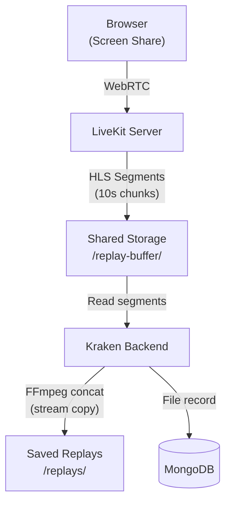

# Replay Buffer

Continuous screen recording during screen share sessions, allowing users to retroactively capture highlights — similar to NVIDIA ShadowPlay or Discord Clipping.

## How it works

1. User enables replay buffer while screen sharing
2. LiveKit records the last 10 minutes as HLS segments (10-second chunks) via Track Composite Egress
3. User clicks "Capture Replay" to save the last 1, 2, 5, or 10 minutes
4. Backend concatenates segments with FFmpeg (stream copy, no re-encoding) into a single MP4

## Key details

- **Egress type**: Track Composite Egress (GStreamer, ~1 CPU / ~1 GB RAM per recording — no Chrome instance needed)
- **Codec**: H.264 video, Opus audio
- **Storage**: ~540 MB per active buffer (12 min @ 1080p 60fps), ~450 MB per saved 10-min clip
- **Cleanup**: Cron job every 5 min deletes segments older than 12 min; hourly cron stops orphaned egress sessions
- **Access control**: `ENABLE_REPLAY_BUFFER` permission + per-community concurrent limit (default 5) + per-user storage quota (default 5 GB)
- **Shared storage required**: LiveKit egress and the backend must read/write the same path — see the storage setup in [Docker Compose](../installation/docker-compose.md#replay-capture-livekit-egress) or [Kubernetes](../installation/kubernetes.md#replay-storage-livekit-egress)
