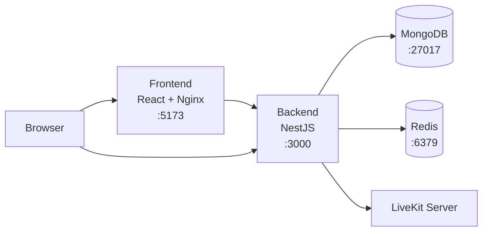

# Self-Hosting with Docker Compose

This guide covers deploying Kraken in production using Docker Compose. For Kubernetes deployments, see the [Helm chart documentation](https://github.com/krakenchat/kraken/tree/main/helm/kraken).

## Prerequisites

- **Docker** (v20+) and **Docker Compose** (v2+)
- A server with at least **2 GB RAM** and **10 GB disk**
- A domain name (optional but recommended for HTTPS)
- A [LiveKit](https://livekit.io/) server (for voice/video — can be configured later)

## Architecture overview

Docker Compose runs four services:



## Deployment steps

### 1. Clone and configure

```bash
git clone https://github.com/krakenchat/kraken.git
cd kraken
cp backend/env.sample backend/.env
```

Edit `backend/.env` with production values:

```env
# Database
MONGODB_URL=mongodb://mongo:27017/kraken?replicaSet=rs0&retryWrites=true&w=majority&directConnection=true

# Generate strong secrets — never use defaults!
JWT_SECRET=<output of: openssl rand -base64 32>
JWT_REFRESH_SECRET=<output of: openssl rand -base64 32>

# Redis
REDIS_HOST=redis

# LiveKit (optional)
LIVEKIT_URL=wss://your-livekit-server.com
LIVEKIT_API_KEY=your-api-key
LIVEKIT_API_SECRET=your-api-secret
```

### 2. Start services

```bash
docker-compose up -d
```

### 3. Initialize the database

```bash
docker compose run --rm backend npm run prisma
```

### 4. Verify

```bash
# Check all containers are running
docker-compose ps

# Check backend logs
docker-compose logs backend

# Check frontend logs
docker-compose logs frontend
```

Visit your server's IP or domain on port 5173 to confirm the frontend loads.

## Production considerations

### Secrets

!!! danger "Change all default secrets"
    Generate strong random values for **every** secret:
    ```bash
    openssl rand -base64 32
    ```

Never commit `.env` files to version control.

### Reverse proxy and HTTPS

In production, place a reverse proxy (Nginx, Caddy, or Traefik) in front of Kraken to handle TLS termination:

- Proxy `your-domain.com` to the frontend (port 5173)
- Proxy `your-domain.com/api` to the backend (port 3000)
- Ensure WebSocket upgrade headers are forwarded for Socket.IO

### Data persistence

Docker Compose uses named volumes for MongoDB and Redis data. These persist across container restarts.

- **Backup MongoDB** regularly: `docker compose exec mongo mongodump --out /backup`
- **Monitor disk usage** — MongoDB and uploads can grow over time

### Resource limits

For production, consider adding resource limits in a `docker-compose.override.yml`:

```yaml
services:
  backend:
    deploy:
      resources:
        limits:
          memory: 1G
  frontend:
    deploy:
      resources:
        limits:
          memory: 512M
```

### Networking

- **MongoDB** and **Redis** should not be exposed to the public internet
- Only expose the frontend and backend ports through your reverse proxy
- Consider using Docker networks to isolate services

## Updating

```bash
# Pull latest changes
git pull

# Rebuild and restart
docker-compose build --no-cache
docker-compose up -d

# Run any database schema updates
docker compose run --rm backend npm run prisma
```

## Kubernetes

For production Kubernetes deployments, Kraken provides an official Helm chart with:

- Bundled or external MongoDB and Redis
- Ingress with TLS via cert-manager
- Horizontal Pod Autoscaler
- Health checks and security contexts

```bash
helm install kraken oci://ghcr.io/krakenchat/charts/kraken \
  --set ingress.hosts[0].host=kraken.yourdomain.com \
  --set livekit.url=wss://your-livekit-server.com \
  --set livekit.apiKey=YOUR_KEY \
  --set livekit.apiSecret=YOUR_SECRET \
  --set secrets.jwtSecret="$(openssl rand -base64 32)" \
  --set secrets.jwtRefreshSecret="$(openssl rand -base64 32)"
```

See the [Helm chart README](https://github.com/krakenchat/kraken/tree/main/helm/kraken) for full documentation.
