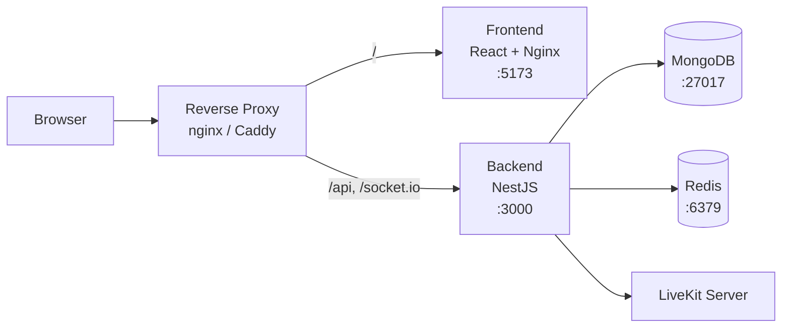

# Self-Hosting with Docker Compose

This guide covers deploying Kraken in production using Docker Compose with pre-built images. For Kubernetes deployments, see the [Kubernetes guide](kubernetes.md).

## Prerequisites

- **Docker** (v20+) and **Docker Compose** (v2+)
- A server with at least **2 GB RAM** and **10 GB disk**
- A domain name (recommended for HTTPS)
- A [LiveKit](https://livekit.io/) server for voice/video ([LiveKit Cloud](https://cloud.livekit.io/) or [self-hosted](https://docs.livekit.io/home/self-hosting/deployment/))

## Architecture overview



## Deployment steps

### 1. Create the Compose file

```bash
mkdir kraken && cd kraken
```

```yaml title="docker-compose.yml"
services:
  backend:
    image: ghcr.io/krakenchat/kraken-backend:latest
    restart: unless-stopped
    ports:
      - "3000:3000"
    environment:
      MONGODB_URL: mongodb://mongo:27017/kraken?replicaSet=rs0&retryWrites=true&w=majority&directConnection=true
      REDIS_HOST: redis
      JWT_SECRET: ${JWT_SECRET:?Set JWT_SECRET in .env}
      JWT_REFRESH_SECRET: ${JWT_REFRESH_SECRET:?Set JWT_REFRESH_SECRET in .env}
      LIVEKIT_URL: ${LIVEKIT_URL:?Set LIVEKIT_URL in .env}
      LIVEKIT_API_KEY: ${LIVEKIT_API_KEY:?Set LIVEKIT_API_KEY in .env}
      LIVEKIT_API_SECRET: ${LIVEKIT_API_SECRET:?Set LIVEKIT_API_SECRET in .env}
    depends_on:
      mongo:
        condition: service_healthy
      redis:
        condition: service_healthy

  frontend:
    image: ghcr.io/krakenchat/kraken-frontend:latest
    restart: unless-stopped
    ports:
      - "5173:5173"
    environment:
      BACKEND_URL: http://backend:3000
    depends_on:
      - backend

  mongo:
    image: mongo:7.0
    restart: unless-stopped
    command: ["--replSet", "rs0", "--bind_ip_all", "--port", "27017"]
    healthcheck:
      test: echo "try { rs.status() } catch (err) { rs.initiate({_id:'rs0',members:[{_id:0,host:'mongo:27017'}]}) }" | mongosh --port 27017 --quiet
      interval: 5s
      timeout: 30s
      start_period: 0s
      start_interval: 1s
      retries: 30
    volumes:
      - mongodata:/data/db
      - mongodb_config:/data/configdb

  redis:
    image: redis:latest
    restart: unless-stopped
    healthcheck:
      test: ["CMD", "redis-cli", "ping"]
      interval: 5s
      timeout: 10s
      retries: 10
    volumes:
      - redisdata:/data

volumes:
  mongodata:
  mongodb_config:
  redisdata:
```

### 2. Configure environment

```env title=".env"
JWT_SECRET=<output of: openssl rand -base64 32>
JWT_REFRESH_SECRET=<output of: openssl rand -base64 32>

# LiveKit (voice/video)
LIVEKIT_URL=wss://your-livekit-server.com
LIVEKIT_API_KEY=your-api-key
LIVEKIT_API_SECRET=your-api-secret
```

Generate strong secrets:

```bash
openssl rand -base64 32
```

!!! danger "Change all default secrets"
    Generate unique random values for **every** secret. Never commit `.env` files to version control.

### 3. Start services

```bash
docker compose up -d
```

### 4. Initialize the database

```bash
docker compose exec backend npx prisma db push --schema=prisma/schema.prisma
```

### 5. Verify

```bash
docker compose ps
docker compose logs backend
docker compose logs frontend
```

Visit your server's IP or domain on port 5173 to confirm the frontend loads.

## Production considerations

### Reverse proxy and HTTPS

In production, place a reverse proxy (nginx, Caddy, or Traefik) in front of Kraken to handle TLS termination:

- Proxy `your-domain.com` to the frontend (port 5173)
- Proxy `your-domain.com/api` to the backend (port 3000)
- Ensure WebSocket upgrade headers are forwarded for Socket.IO

### Data persistence

Docker Compose uses named volumes for MongoDB and Redis data. These persist across container restarts.

- **Backup MongoDB** regularly: `docker compose exec mongo mongodump --out /backup`
- **Monitor disk usage** — MongoDB and uploads can grow over time

### Resource limits

For production, consider adding resource limits in a `docker-compose.override.yml`:

```yaml
services:
  backend:
    deploy:
      resources:
        limits:
          memory: 1G
  frontend:
    deploy:
      resources:
        limits:
          memory: 512M
```

### Networking

- **MongoDB** and **Redis** should not be exposed to the public internet — remove their `ports` mappings or bind to `127.0.0.1`
- Only expose the frontend and backend through your reverse proxy
- Consider Docker networks to isolate services

### Replay capture (LiveKit egress)

The replay/clip capture feature requires LiveKit egress to write HLS segments to a location that the Kraken backend can also read from. Both services need access to the same storage path.

For Docker Compose, mount a shared volume into both the LiveKit egress container and the Kraken backend:

```yaml
services:
  backend:
    volumes:
      - egress-data:/out
    environment:
      REPLAY_EGRESS_OUTPUT_PATH: /out
      REPLAY_SEGMENTS_PATH: /out

  # Your LiveKit egress service must also mount egress-data:/out

volumes:
  egress-data:
```

!!! note "LiveKit Cloud"
    LiveKit Cloud writes egress output to cloud storage (S3/GCS/Azure Blob), which Kraken can't read from yet. Replay capture is not available with LiveKit Cloud until cloud storage support is added. See [#227](https://github.com/krakenchat/kraken/issues/227) for progress.

## Updating

```bash
docker compose pull
docker compose up -d

# Run any database schema updates
docker compose exec backend npx prisma db push --schema=prisma/schema.prisma
```

## Kubernetes

For larger deployments, Kraken provides an official Helm chart. See the [Kubernetes guide](kubernetes.md).
