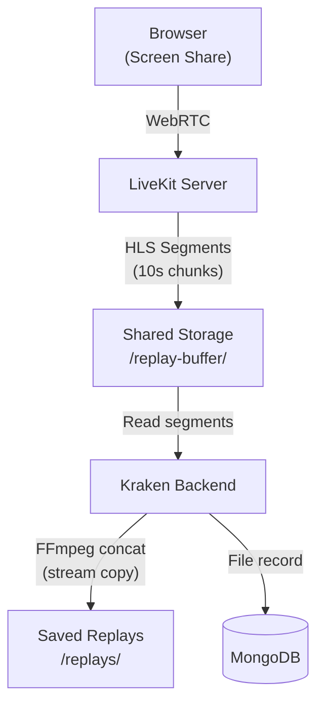

# Replay Buffer

The replay buffer provides **continuous screen recording** during screen share sessions, allowing users to retroactively capture highlights -- similar to NVIDIA ShadowPlay or Discord Clipping.

## How It Works

1. User enables replay buffer while screen sharing
2. LiveKit continuously records the last 10 minutes as HLS segments (10-second chunks)
3. When something interesting happens, the user clicks "Capture Replay" (1, 2, 5, or 10 minutes)
4. Backend concatenates segments via FFmpeg (stream copy, no re-encoding) into a single MP4
5. User can share the clip to a channel or save to their personal clip library

## Architecture



### Technology Stack

| Component | Technology | Purpose |
|-----------|-----------|---------|
| Recording | LiveKit Track Composite Egress (GStreamer) | Record screen share to HLS segments |
| Storage | Local disk / NFS / Docker volume | Store temp segments and permanent replays |
| Concatenation | FFmpeg (stream copy, no re-encoding) | Combine segments into MP4 |
| Scheduling | `@nestjs/schedule` | Cleanup cron jobs |
| Codec | H.264 video, Opus audio | Broad browser compatibility |

### Why Track Composite Egress

Track Composite Egress uses GStreamer directly (no Chrome), consuming ~1 CPU and ~1GB RAM per recording. This allows 4-8 concurrent recordings per 4-CPU pod, compared to 1-2 for Room Composite which requires a Chrome instance.

## Storage Layout

```
${FILE_UPLOAD_DEST}/
├── replay-buffer/          # Temporary HLS segments (auto-cleaned every 5 min)
│   └── {roomName}/{userId}/
│       ├── segment-*.ts    # 10-second MPEG-TS segments
│       ├── live.m3u8       # Rolling playlist (last ~72 segments = 12 min)
│       └── full.m3u8       # Complete playlist
└── replays/                # Permanent captured replays
    └── {userId}/
        └── {timestamp}.mp4
```

**Storage requirements**: ~540MB per active buffer (12 min @ 1080p 60fps), ~450MB per saved 10-min clip. Default user quota: 5GB.

## API Endpoints

All endpoints require JWT authentication. Base path: `/livekit-replay`

| Method | Endpoint | Permission | Description |
|--------|----------|-----------|-------------|
| `POST` | `/start` | `ENABLE_REPLAY_BUFFER` | Start recording |
| `POST` | `/stop/:sessionId` | Owner | Stop recording |
| `POST` | `/capture` | `CAPTURE_REPLAY` | Save last N minutes as MP4 |
| `GET` | `/status/:roomName` | Any authenticated | List active sessions in room |
| `GET` | `/my-clips` | Own data | List saved clips (paginated) |
| `DELETE` | `/clips/:id` | Owner | Delete clip, free quota |
| `GET` | `/admin/community/:id/config` | `MANAGE_REPLAY_LIMITS` | Get community config |
| `PATCH` | `/admin/community/:id/config` | `MANAGE_REPLAY_LIMITS` | Update community limits |
| `GET` | `/admin/users/:id/quota` | Instance admin | Get user quota |
| `PATCH` | `/admin/users/:id/quota` | Instance admin | Update user quota |

### Capture Request

```bash
curl -X POST http://localhost:3000/livekit-replay/capture \
  -H "Authorization: Bearer $TOKEN" \
  -H "Content-Type: application/json" \
  -d '{
    "sessionId": "session-id",
    "durationMinutes": 5,
    "shareOption": "channel",
    "targetChannelId": "channel-id"
  }'
```

## Access Control

Three permission checks gate replay buffer usage:

1. **RBAC**: User must have `ENABLE_REPLAY_BUFFER` permission
2. **Community limit**: Max concurrent buffers per community (default: 5, configurable)
3. **Storage quota**: Per-user quota for saved clips (default: 5GB)

## Cleanup

- **Segment cleanup**: Cron job every 5 minutes deletes segments older than 12 minutes
- **Orphaned sessions**: Hourly cron detects and stops egress sessions without active users
- **User deletion**: Users can delete their clips at any time to free quota

## Troubleshooting

### Replay Buffer Won't Start

| Error | Cause | Solution |
|-------|-------|---------|
| "User already has an active replay buffer" | Existing session | Stop the active session first |
| "Community replay buffer limit reached" | Too many concurrent | Increase community `maxConcurrent` or wait |
| "Permission denied" | Missing RBAC permission | Grant `ENABLE_REPLAY_BUFFER` to user's role |

### Capture Failures

| Error | Cause | Solution |
|-------|-------|---------|
| "No segments found" | Segments cleaned up or never created | Capture sooner; check that egress is writing segments |
| "FFmpeg concatenation failed" | Corrupt segment, disk full, or permissions | Check disk space; verify segments with `ffmpeg -i segment.ts` |
| "User quota exceeded" (507) | Storage quota full | Delete old clips or increase quota |

### Storage Issues

```bash
# Check disk usage
df -h /var/lib/kraken/storage
du -sh /var/lib/kraken/storage/replay-buffer/*
du -sh /var/lib/kraken/storage/replays/*
```

### LiveKit Issues

- Verify LiveKit credentials: `docker compose exec backend env | grep LIVEKIT`
- Ensure user is actively screen sharing when starting buffer
- Check LiveKit server version (requires v1.2.0+)
