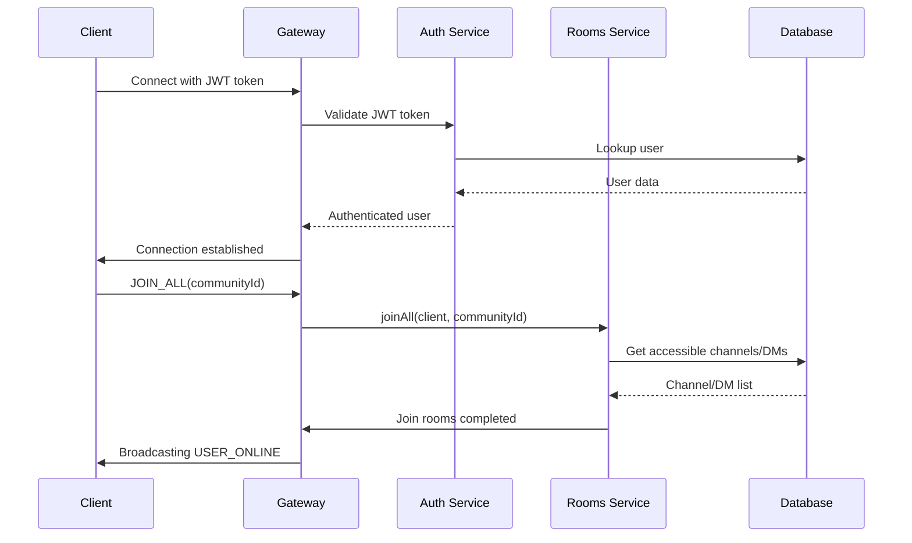
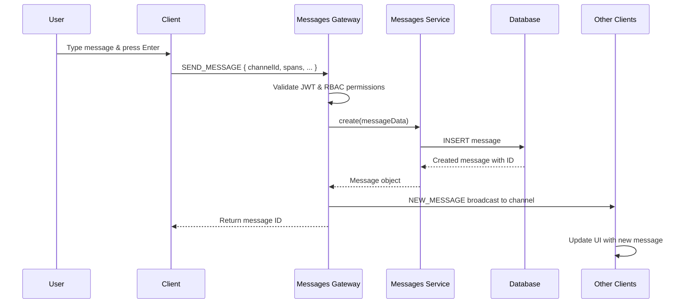
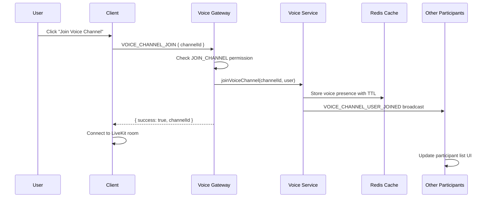

# Kraken WebSocket Events Documentation

> **Real-time Communication System**  
> **Backend Gateways:** `backend/src/*/` - 4 gateway modules  
> **Frontend Integration:** `frontend/src/hooks/` and `frontend/src/utils/`  
> **Protocol:** Socket.IO with JWT authentication and Redis scaling

## Overview

Kraken's real-time communication system uses Socket.IO WebSockets to provide Discord-like features including real-time messaging, presence updates, and voice channel management. The system implements JWT authentication, role-based access control (RBAC), and Redis-backed scaling for multi-instance deployments.

### Core Architecture

- **Authentication**: JWT tokens with automatic refresh
- **Authorization**: RBAC guards on all sensitive events  
- **Scaling**: Redis adapter for multi-instance WebSocket support
- **Room Management**: Automatic room joining based on user permissions
- **Type Safety**: Full TypeScript coverage with shared event definitions

---

## WebSocket Gateway Modules

### 1. Messages Gateway (`messages.gateway.ts`)

Handles real-time messaging for both channels and direct messages.

### 2. Presence Gateway (`presence.gateway.ts`) 

Manages user online/offline status and presence updates.

### 3. Rooms Gateway (`rooms.gateway.ts`)

Manages WebSocket room connections and user connectivity.

### 4. Voice Presence Gateway (`voice-presence.gateway.ts`)

Handles voice channel presence, state updates, and voice-related events.

---

## Client → Server Events

Events sent from the frontend to the backend.

### JOIN_ALL

**Event:** `joinAll`  
**Purpose:** Join all rooms a user has access to in a community  
**Authentication:** Required (JWT)  
**RBAC Required:** `READ_COMMUNITY`

#### Payload Structure

```typescript
// Payload is a simple string
type Payload = string; // communityId
```

#### Handler Implementation

```typescript
@SubscribeMessage(ClientEvents.JOIN_ALL)
@RequiredActions(RbacActions.READ_COMMUNITY)
@RbacResource({
  type: RbacResourceType.COMMUNITY,
  source: ResourceIdSource.TEXT_PAYLOAD,
})
async joinAll(
  @ConnectedSocket() client: AuthenticatedSocket,
  @MessageBody() communityId: string,
) {
  // Joins user's personal room
  await client.join(client.handshake.user.id);
  
  // Auto-joins all accessible channels, DMs, and alias groups
  return this.roomsService.joinAll(client, communityId);
}
```

#### Frontend Usage

```typescript
const socket = useSocket();

// Join all rooms when entering a community
useEffect(() => {
  if (socket && communityId) {
    socket.emit(ClientEvents.JOIN_ALL, communityId);
  }
}, [socket, communityId]);
```

---

### JOIN_ROOM

**Event:** `joinRoom`  
**Purpose:** Join a specific channel room  
**Authentication:** Required (JWT)  
**RBAC Required:** `READ_COMMUNITY` for the channel

#### Payload Structure

```typescript
type Payload = string; // channelId
```

#### Frontend Usage

```typescript
const joinChannel = (channelId: string) => {
  socket.emit(ClientEvents.JOIN_ROOM, channelId);
};
```

---

### SEND_MESSAGE

**Event:** `sendMessage`  
**Purpose:** Send a message to a channel  
**Authentication:** Required (JWT)  
**RBAC Required:** `CREATE_MESSAGE` for the channel

#### Payload Structure

```typescript
interface SendMessagePayload {
  channelId: string | null;
  directMessageGroupId: string | null;
  spans: MessageSpan[];          // Rich text with mentions, formatting
  attachments: Attachment[];     // File attachments
  reactions: Reaction[];         // Message reactions
}

interface MessageSpan {
  type: SpanType;                // TEXT, MENTION, CHANNEL_LINK, etc.
  text: string | null;
  userId: string | null;         // For user mentions
  channelId: string | null;      // For channel links
  communityId: string | null;    // For community references
  aliasId: string | null;        // For alias mentions
  specialKind: string | null;    // Special formatting
}

interface Attachment {
  url: string;
  filename: string;
  filetype: string;
  size: number;
}

interface Reaction {
  emoji: string;
  userIds: string[];
}
```

#### Frontend Usage

```typescript
import { useChannelWebSocket } from '@/hooks/useChannelWebSocket';

function MessageComposer({ channelId }: { channelId: string }) {
  const { sendMessage } = useChannelWebSocket(communityId);

  const handleSend = (content: string) => {
    sendMessage({
      channelId,
      directMessageGroupId: null,
      spans: [
        { type: 'TEXT', text: content, userId: null, channelId: null, 
          communityId: null, aliasId: null, specialKind: null }
      ],
      attachments: [],
      reactions: [],
      authorId: currentUser.id,
      sentAt: new Date(),
    });
  };

  return (
    <input 
      onKeyPress={(e) => e.key === 'Enter' && handleSend(e.target.value)} 
    />
  );
}
```

---

### SEND_DM

**Event:** `sendDirectMessage`  
**Purpose:** Send a direct message  
**Authentication:** Required (JWT)  
**RBAC Required:** `CREATE_MESSAGE` for the DM group

#### Payload Structure

```typescript
// Same as SEND_MESSAGE but with directMessageGroupId instead of channelId
interface SendDMPayload extends Omit<SendMessagePayload, 'channelId'> {
  directMessageGroupId: string;
  channelId: null;
}
```

---

### PRESENCE_ONLINE

**Event:** `presenceOnline`  
**Purpose:** Update user's online status with TTL  
**Authentication:** Required (JWT)  
**RBAC Required:** None (user can always update own presence)

#### Payload Structure

```typescript
// No payload - uses authenticated user from JWT
```

#### Handler Implementation

```typescript
@SubscribeMessage(ClientEvents.PRESENCE_ONLINE)
async handleMessage(
  @ConnectedSocket() client: AuthenticatedSocket,
): Promise<string> {
  await this.presenceService.setOnline(
    client.handshake.user.id,
    60, // 1 minute TTL
  );
  return 'ACK';
}
```

#### Frontend Usage

```typescript
// Automatically send presence updates
useEffect(() => {
  const interval = setInterval(() => {
    if (socket?.connected) {
      socket.emit(ClientEvents.PRESENCE_ONLINE);
    }
  }, 30000); // Every 30 seconds

  return () => clearInterval(interval);
}, [socket]);
```

---

### VOICE_CHANNEL_JOIN

**Event:** `voice_channel_join`  
**Purpose:** Join a voice channel  
**Authentication:** Required (JWT)  
**RBAC Required:** `JOIN_CHANNEL` for the voice channel

#### Payload Structure

```typescript
interface VoiceChannelJoinPayload {
  channelId: string;
}
```

#### Handler Implementation

```typescript
@SubscribeMessage(ClientEvents.VOICE_CHANNEL_JOIN)
@RequiredActions(RbacActions.JOIN_CHANNEL)
@RbacResource({
  type: RbacResourceType.CHANNEL,
  idKey: 'channelId',
  source: ResourceIdSource.PAYLOAD,
})
async handleJoinVoiceChannel(
  @ConnectedSocket() client: AuthenticatedSocket,
  @MessageBody() data: VoiceChannelJoinPayload,
) {
  const user = client.handshake.user;
  await this.voicePresenceService.joinVoiceChannel(data.channelId, user);
  
  return {
    success: true,
    channelId: data.channelId,
  };
}
```

#### Frontend Usage

```typescript
const joinVoiceChannel = (channelId: string) => {
  socket.emit(ClientEvents.VOICE_CHANNEL_JOIN, { channelId });
};
```

---

### VOICE_CHANNEL_LEAVE

**Event:** `voice_channel_leave`  
**Purpose:** Leave a voice channel  
**Authentication:** Required (JWT)  
**RBAC Required:** `JOIN_CHANNEL` for the voice channel

#### Payload Structure

```typescript
interface VoiceChannelLeavePayload {
  channelId: string;
}
```

#### Frontend Usage

```typescript
const leaveVoiceChannel = (channelId: string) => {
  socket.emit(ClientEvents.VOICE_CHANNEL_LEAVE, { channelId });
};
```

---

### VOICE_STATE_UPDATE

**Event:** `voice_state_update`  
**Purpose:** Update voice settings (mute, video, screen share)  
**Authentication:** Required (JWT)  
**RBAC Required:** `JOIN_CHANNEL` for the voice channel

#### Payload Structure

```typescript
interface VoiceStateUpdatePayload {
  channelId: string;
  isVideoEnabled?: boolean;
  isScreenSharing?: boolean;
  isMuted?: boolean;
  isDeafened?: boolean;
}
```

#### Frontend Usage

```typescript
const toggleMute = (channelId: string, isMuted: boolean) => {
  socket.emit(ClientEvents.VOICE_STATE_UPDATE, {
    channelId,
    isMuted,
  });
};

const toggleVideo = (channelId: string, isVideoEnabled: boolean) => {
  socket.emit(ClientEvents.VOICE_STATE_UPDATE, {
    channelId,
    isVideoEnabled,
  });
};
```

---

### VOICE_PRESENCE_REFRESH

**Event:** `voice_presence_refresh`  
**Purpose:** Refresh voice presence TTL to stay in channel  
**Authentication:** Required (JWT)  
**RBAC Required:** `JOIN_CHANNEL` for the voice channel

#### Payload Structure

```typescript
interface VoicePresenceRefreshPayload {
  channelId: string;
}
```

---

## Server → Client Events

Events sent from the backend to the frontend.

### NEW_MESSAGE

**Event:** `newMessage`  
**Purpose:** Notify clients of new messages in channels/DMs  
**Scope:** Room-specific (channel or DM group)  
**Trigger:** After successful message creation

#### Payload Structure

```typescript
interface NewMessagePayload {
  message: Message;
}

interface Message {
  id: string;
  channelId: string | null;
  directMessageGroupId: string | null;
  authorId: string;
  sentAt: Date;
  editedAt: Date | null;
  deletedAt: Date | null;
  spans: MessageSpan[];
  attachments: Attachment[];
  reactions: Reaction[];
}
```

#### Backend Emission

```typescript
// In messages.gateway.ts
const message = await this.messagesService.create(payload);

this.websocketService.sendToRoom(
  payload.channelId!,
  ServerEvents.NEW_MESSAGE,
  { message }
);
```

#### Frontend Handling

```typescript
import { useChannelWebSocket } from '@/hooks/useChannelWebSocket';

function ChatChannel({ communityId }: { communityId: string }) {
  useChannelWebSocket(communityId); // Automatically handles NEW_MESSAGE events
  
  // Messages are automatically updated in Redux state
  const messages = useSelector(state => 
    state.messages.channelMessages[currentChannelId] || []
  );
  
  return (
    <div>
      {messages.map(message => (
        <MessageComponent key={message.id} message={message} />
      ))}
    </div>
  );
}
```

---

### UPDATE_MESSAGE

**Event:** `updateMessage`  
**Purpose:** Notify clients when a message is edited  
**Scope:** Room-specific (channel or DM group)  
**Trigger:** Message edit operation

#### Payload Structure

```typescript
interface UpdateMessagePayload {
  message: Message; // Updated message with editedAt timestamp
}
```

#### Frontend Handling

```typescript
// Automatically handled by useChannelWebSocket hook
// Updates message in Redux store with new content and editedAt timestamp
```

---

### DELETE_MESSAGE

**Event:** `deleteMessage`  
**Purpose:** Notify clients when a message is deleted  
**Scope:** Room-specific (channel or DM group)  
**Trigger:** Message deletion operation

#### Payload Structure

```typescript
interface DeleteMessagePayload {
  messageId: string;
  channelId?: string | null;
  directMessageGroupId?: string | null;
}
```

#### Frontend Handling

```typescript
// Automatically handled by useChannelWebSocket hook
// Removes message from Redux store
```

---

### USER_ONLINE

**Event:** `userOnline`  
**Purpose:** Notify all clients when a user comes online  
**Scope:** Global broadcast  
**Trigger:** User connects to WebSocket or sends PRESENCE_ONLINE

#### Payload Structure

```typescript
interface UserOnlinePayload {
  userId: string;
}
```

#### Backend Emission

```typescript
// In rooms.gateway.ts when user joins all rooms
this.websocketService.sendToAll(ServerEvents.USER_ONLINE, {
  userId: user.id,
});
```

#### Frontend Handling

```typescript
// Update user presence in UI
const handleUserOnline = ({ userId }: UserOnlinePayload) => {
  dispatch(updateUserPresence({ userId, isOnline: true }));
};
```

---

### USER_OFFLINE

**Event:** `userOffline`  
**Purpose:** Notify all clients when a user goes offline  
**Scope:** Global broadcast  
**Trigger:** User disconnects from WebSocket

#### Payload Structure

```typescript
interface UserOfflinePayload {
  userId: string;
}
```

#### Backend Emission

```typescript
// In rooms.gateway.ts on disconnect
handleDisconnect(client: Socket) {
  const user = (client.handshake as { user?: UserEntity }).user;
  this.websocketService.sendToAll(ServerEvents.USER_OFFLINE, {
    userId: user?.id,
  });
}
```

---

### VOICE_CHANNEL_USER_JOINED

**Event:** `voiceChannelUserJoined`  
**Purpose:** Notify channel participants when someone joins voice  
**Scope:** Voice channel room  
**Trigger:** User joins voice channel

#### Payload Structure

```typescript
interface VoiceChannelUserJoinedPayload {
  channelId: string;
  user: VoicePresenceUser;
}

interface VoicePresenceUser {
  id: string;
  username: string;
  displayName?: string;
  avatarUrl?: string;
  joinedAt: Date;
  isVideoEnabled: boolean;
  isScreenSharing: boolean;
  isMuted: boolean;
  isDeafened: boolean;
}
```

#### Frontend Handling

```typescript
import { useVoiceEvents } from '@/hooks/useVoiceEvents';

function VoiceChannel() {
  useVoiceEvents(); // Automatically handles voice events
  
  // Voice participants updated automatically in Redux state
  const participants = useSelector(state => state.voice.participants);
  
  return (
    <div>
      {participants.map(user => (
        <VoiceParticipant key={user.id} user={user} />
      ))}
    </div>
  );
}
```

---

### VOICE_CHANNEL_USER_LEFT

**Event:** `voiceChannelUserLeft`  
**Purpose:** Notify channel participants when someone leaves voice  
**Scope:** Voice channel room  
**Trigger:** User leaves voice channel or disconnects

#### Payload Structure

```typescript
interface VoiceChannelUserLeftPayload {
  channelId: string;
  userId: string;
  user: VoicePresenceUser;
}
```

---

### VOICE_CHANNEL_USER_UPDATED

**Event:** `voiceChannelUserUpdated`  
**Purpose:** Notify channel when user's voice state changes  
**Scope:** Voice channel room  
**Trigger:** User toggles mute/video/screen share

#### Payload Structure

```typescript
interface VoiceChannelUserUpdatedPayload {
  channelId: string;
  userId: string;
  user: VoicePresenceUser;
  updates: Record<string, unknown>;
}
```

---

### ACK

**Event:** `ack`  
**Purpose:** Acknowledge successful event processing  
**Scope:** User-specific  
**Trigger:** Successful event handling

#### Payload Structure

```typescript
interface AckPayload {
  id: string;
  [key: string]: unknown;
}
```

---

### ERROR

**Event:** `error`  
**Purpose:** Notify client of errors during event processing  
**Scope:** User-specific  
**Trigger:** Event validation failures, permissions errors

#### Payload Structure

```typescript
interface ErrorPayload {
  message: string;
  code?: string | number;
  event?: string;           // Original event that caused error
  details?: any;           // Additional error context
}
```

#### Backend Emission

```typescript
// Permission denied
client.emit(ServerEvents.ERROR, {
  event: ClientEvents.SEND_MESSAGE,
  message: 'Insufficient permissions',
  code: 'PERMISSION_DENIED',
});

// Validation error
client.emit(ServerEvents.ERROR, {
  event: ClientEvents.VOICE_CHANNEL_JOIN,
  message: 'Invalid channel ID',
  code: 'VALIDATION_ERROR',
  details: validationErrors,
});
```

#### Frontend Handling

```typescript
const handleError = ({ message, code, event }: ErrorPayload) => {
  console.error(`WebSocket Error [${event}]:`, message);
  
  // Show user-friendly error notifications
  if (code === 'PERMISSION_DENIED') {
    showNotification('You do not have permission to perform this action');
  } else {
    showNotification(`Error: ${message}`);
  }
};

socket.on(ServerEvents.ERROR, handleError);
```

---

## Room Management

### Automatic Room Joining

When a user connects and emits `JOIN_ALL`, the system automatically joins them to:

1. **Personal Room**: User's own ID for direct notifications
2. **Public Channels**: All non-private channels in the community they have access to
3. **Private Channels**: Channels with explicit membership records
4. **Direct Message Groups**: All DM groups the user is a member of
5. **Alias Groups**: Groups for message alias/mention handling

```typescript
// rooms.service.ts - joinAll method
async joinAll(client: AuthenticatedSocket, communityId: string) {
  // Personal room
  await client.join(client.handshake.user.id);
  
  // Public channels
  const publicChannels = await this.databaseService.channel.findMany({
    where: { communityId, isPrivate: false },
  });
  
  for (const channel of publicChannels) {
    await client.join(channel.id);
  }
  
  // Private channels with explicit membership
  const privateChannelMemberships = await this.databaseService.channelMembership.findMany({
    where: {
      userId: client.handshake.user.id,
      channel: { communityId, isPrivate: true },
    },
    include: { channel: true },
  });
  
  for (const membership of privateChannelMemberships) {
    await client.join(membership.channelId);
  }
  
  // Direct message groups
  const directMessages = await this.databaseService.directMessageGroupMember.findMany({
    where: { userId: client.handshake.user.id },
  });
  
  for (const directMessage of directMessages) {
    await client.join(directMessage.groupId);
  }
  
  // Alias groups
  const aliasGroups = await this.databaseService.aliasGroupMember.findMany({
    where: { userId: client.handshake.user.id },
  });
  
  for (const aliasGroup of aliasGroups) {
    await client.join(aliasGroup.aliasGroupId);
  }
}
```

### Room Broadcasting Patterns

```typescript
// Send to specific room (channel/DM group)
this.websocketService.sendToRoom(roomId, event, payload);

// Send to all connected clients
this.websocketService.sendToAll(event, payload);

// Send to specific user (using their personal room)
client.to(userId).emit(event, payload);

// Send to all users in room except sender
client.to(roomId).emit(event, payload);
```

---

## Connection Lifecycle

### Connection Flow



### Authentication Process

```typescript
// ws-jwt-auth.guard.ts
async canActivate(context: ExecutionContext): Promise<boolean> {
  const client = context.switchToWs().getClient<Socket>();
  
  // Extract token from auth or authorization header
  let token = client.handshake.auth?.token || 
              client.handshake.headers?.authorization;
              
  if (!token) {
    client.disconnect(true);
    return false;
  }
  
  // Remove Bearer prefix
  if (token.startsWith('Bearer ')) {
    token = token.split('Bearer ')[1];
  }
  
  try {
    // Verify JWT and attach user to socket
    const payload = this.jwtService.verify<{ sub: string }>(token);
    const user = await this.userService.findById(payload.sub);
    
    if (!user) throw new Error('User not found');
    
    (client.handshake as any).user = user;
    return true;
  } catch (error) {
    client.disconnect(true);
    return false;
  }
}
```

### Connection Cleanup

```typescript
// voice-presence.gateway.ts
async handleDisconnect(client: Socket) {
  const user = (client.handshake as { user?: UserEntity }).user;
  if (!user) return;
  
  // Clean up user's voice presence in all channels
  const voiceChannels = await this.voicePresenceService.getUserVoiceChannels(user.id);
  
  for (const channelId of voiceChannels) {
    await this.voicePresenceService.leaveVoiceChannel(channelId, user.id);
  }
}
```

---

## Frontend Integration

### Socket Connection Management

```typescript
// socketSingleton.ts - Connection with automatic token refresh
export async function getSocketSingleton(): Promise<Socket> {
  if (socketInstance?.connected) {
    return socketInstance;
  }
  
  // Refresh token before connecting
  let token = getCachedItem<string>("accessToken");
  try {
    const refreshResponse = await axios.post<{ accessToken: string }>("/api/auth/refresh");
    if (refreshResponse.data?.accessToken) {
      setCachedItem("accessToken", refreshResponse.data.accessToken);
      token = refreshResponse.data.accessToken;
    }
  } catch (error) {
    console.error("Error refreshing token", error);
    token = null;
  }
  
  if (!token) {
    throw new Error("No token available for socket connection");
  }
  
  socketInstance = io("http://localhost:3000", {
    transports: ["websocket"],
    auth: { token: `Bearer ${token}` },
  });
  
  return new Promise((resolve, reject) => {
    socketInstance!.on("connect", () => {
      console.log("Socket connected " + socketInstance!.id);
      resolve(socketInstance!);
    });
    
    socketInstance!.on("connect_error", (err) => {
      reject(err);
    });
  });
}
```

### Type-Safe Event Handling

```typescript
// SocketContext.ts - Type definitions
export type ServerToClientEvents = {
  [ServerEvents.NEW_MESSAGE]: (data: NewMessagePayload) => void;
  [ServerEvents.UPDATE_MESSAGE]: (data: UpdateMessagePayload) => void;
  [ServerEvents.DELETE_MESSAGE]: (data: DeleteMessagePayload) => void;
  [ServerEvents.VOICE_CHANNEL_USER_JOINED]: (data: { 
    channelId: string; 
    user: VoicePresenceUser 
  }) => void;
  [ServerEvents.VOICE_CHANNEL_USER_LEFT]: (data: { 
    channelId: string; 
    userId: string; 
    user: VoicePresenceUser 
  }) => void;
  [ServerEvents.VOICE_CHANNEL_USER_UPDATED]: (data: { 
    channelId: string; 
    userId: string; 
    user: VoicePresenceUser; 
    updates: Record<string, unknown> 
  }) => void;
  [ServerEvents.ACK]: (data: AckPayload) => void;
  [ServerEvents.ERROR]: (data: ErrorPayload) => void;
};

export type ClientToServerEvents = {
  [ClientEvents.JOIN_ALL]: (communityId: string) => void;
  [ClientEvents.JOIN_ROOM]: (channelId: string) => void;
  [ClientEvents.SEND_MESSAGE]: (
    data: Omit<NewMessagePayload, "id">,
    callback?: (messageId: string) => void
  ) => void;
  [ClientEvents.VOICE_CHANNEL_JOIN]: (data: { channelId: string }) => void;
  [ClientEvents.VOICE_CHANNEL_LEAVE]: (data: { channelId: string }) => void;
  [ClientEvents.VOICE_STATE_UPDATE]: (data: VoiceStateUpdatePayload) => void;
  [ClientEvents.VOICE_PRESENCE_REFRESH]: (data: { channelId: string }) => void;
};
```

### Custom Hooks for Event Handling

```typescript
// useChannelWebSocket.ts - Message event handling
export function useChannelWebSocket(communityId: string | undefined) {
  const dispatch = useAppDispatch();
  const socket = useSocket();

  useEffect(() => {
    if (!socket || !communityId) return;

    const handleNewMessage = ({ message }: { message: Message }) => {
      const targetChannelId = message.channelId || message.directMessageGroupId;
      if (targetChannelId) {
        dispatch(prependMessage({ channelId: targetChannelId, message }));
      }
    };

    const handleUpdateMessage = ({ message }: { message: Message }) => {
      const targetChannelId = message.channelId || message.directMessageGroupId;
      if (targetChannelId) {
        dispatch(updateMessage({ channelId: targetChannelId, message }));
      }
    };

    const handleDeleteMessage = ({ messageId, channelId, directMessageGroupId }: {
      messageId: string;
      channelId?: string | null;
      directMessageGroupId?: string | null;
    }) => {
      const targetChannelId = channelId || directMessageGroupId;
      if (targetChannelId) {
        dispatch(deleteMessage({ channelId: targetChannelId, id: messageId }));
      }
    };

    socket.on(ServerEvents.NEW_MESSAGE, handleNewMessage);
    socket.on(ServerEvents.UPDATE_MESSAGE, handleUpdateMessage);
    socket.on(ServerEvents.DELETE_MESSAGE, handleDeleteMessage);

    return () => {
      socket.off(ServerEvents.NEW_MESSAGE, handleNewMessage);
      socket.off(ServerEvents.UPDATE_MESSAGE, handleUpdateMessage);
      socket.off(ServerEvents.DELETE_MESSAGE, handleDeleteMessage);
    };
  }, [socket, communityId, dispatch]);

  const sendMessage = (msg: Omit<Message, "id">) => {
    socket.emit(ClientEvents.SEND_MESSAGE, msg);
  };

  return { sendMessage };
}
```

```typescript
// useVoiceEvents.ts - Voice event handling with Redux integration
export const useVoiceEvents = () => {
  const dispatch = useDispatch<AppDispatch>();
  const socket = useSocket();
  const currentChannelId = useSelector((state: RootState) => state.voice.currentChannelId);

  useEffect(() => {
    if (!socket || !currentChannelId) return;

    const handleUserJoined = (data: { channelId: string; user: VoicePresenceUser }) => {
      if (data.channelId === currentChannelId) {
        // Update both Redux state and RTK Query cache
        dispatch(updateParticipant(data.user));
        dispatch(
          voicePresenceApi.util.updateQueryData('getChannelPresence', data.channelId, (draft) => {
            const existingIndex = draft.users.findIndex(u => u.id === data.user.id);
            if (existingIndex === -1) {
              draft.users.push(data.user);
              draft.count = draft.users.length;
            }
          })
        );
      }
    };

    const handleUserLeft = (data: { channelId: string; userId: string }) => {
      if (data.channelId === currentChannelId) {
        dispatch(removeParticipant(data.userId));
        dispatch(
          voicePresenceApi.util.updateQueryData('getChannelPresence', data.channelId, (draft) => {
            const index = draft.users.findIndex(u => u.id === data.userId);
            if (index !== -1) {
              draft.users.splice(index, 1);
              draft.count = draft.users.length;
            }
          })
        );
      }
    };

    const handleUserUpdated = (data: { channelId: string; user: VoicePresenceUser }) => {
      if (data.channelId === currentChannelId) {
        dispatch(updateParticipant(data.user));
        dispatch(
          voicePresenceApi.util.updateQueryData('getChannelPresence', data.channelId, (draft) => {
            const index = draft.users.findIndex(u => u.id === data.user.id);
            if (index !== -1) {
              draft.users[index] = data.user;
            }
          })
        );
      }
    };

    socket.on(ServerEvents.VOICE_CHANNEL_USER_JOINED, handleUserJoined);
    socket.on(ServerEvents.VOICE_CHANNEL_USER_LEFT, handleUserLeft);
    socket.on(ServerEvents.VOICE_CHANNEL_USER_UPDATED, handleUserUpdated);

    return () => {
      socket.off(ServerEvents.VOICE_CHANNEL_USER_JOINED, handleUserJoined);
      socket.off(ServerEvents.VOICE_CHANNEL_USER_LEFT, handleUserLeft);
      socket.off(ServerEvents.VOICE_CHANNEL_USER_UPDATED, handleUserUpdated);
    };
  }, [socket, currentChannelId, dispatch]);
};
```

---

## Error Handling

### WebSocket Error Structure

```typescript
interface WebSocketError {
  event: string;           // The original event that caused the error
  message: string;         // Human-readable error message  
  code?: string;           // Error code for programmatic handling
  details?: any;           // Additional error context
}
```

### Common Error Scenarios

#### Permission Errors
```typescript
// Backend emission
client.emit(ServerEvents.ERROR, {
  event: ClientEvents.SEND_MESSAGE,
  message: 'Insufficient permissions to send messages in this channel',
  code: 'PERMISSION_DENIED',
});

// Frontend handling
socket.on(ServerEvents.ERROR, ({ code, message, event }) => {
  if (code === 'PERMISSION_DENIED') {
    showNotification({
      type: 'error',
      title: 'Access Denied',
      message,
    });
  }
});
```

#### Validation Errors
```typescript
// Backend - automatic validation with ValidationPipe
@UsePipes(new ValidationPipe({ 
  exceptionFactory: (errors) => new WsException(errors) 
}))

// Results in structured error emission
client.emit(ServerEvents.ERROR, {
  event: ClientEvents.VOICE_STATE_UPDATE,
  message: 'Validation failed',
  code: 'VALIDATION_ERROR',
  details: [
    { field: 'channelId', error: 'channelId must be a string' }
  ],
});
```

#### Connection Errors
```typescript
// Authentication failures result in immediate disconnection
if (!token || !user) {
  client.emit(ServerEvents.ERROR, {
    message: 'Authentication failed',
    code: 'AUTH_FAILED',
  });
  client.disconnect(true);
}
```

---

## Event Flow Examples

### Example 1: Sending a Message



### Example 2: Joining Voice Channel



### Example 3: Connection Lifecycle

1. **Client Connection**
   - Client sends JWT token in handshake
   - `WsJwtAuthGuard` validates token and attaches user
   - Gateway emits connection success

2. **Room Joining** 
   - Client emits `JOIN_ALL` with community ID
   - Server joins client to all accessible rooms
   - Global `USER_ONLINE` broadcast

3. **Active Communication**
   - Real-time message/voice events
   - Presence heartbeats every 30 seconds
   - State synchronization

4. **Disconnection**
   - Cleanup voice presence from all channels
   - Global `USER_OFFLINE` broadcast
   - Socket cleanup

---

## Performance Considerations

### Scalability
- **Redis Adapter**: Enables horizontal scaling across multiple server instances
- **Room-based Broadcasting**: Messages only sent to relevant participants
- **JWT Validation**: Stateless authentication scales with load balancers
- **Event Throttling**: Rate limiting prevents spam (not yet implemented)

### Memory Management
- **Connection Cleanup**: Automatic cleanup on disconnect via `handleDisconnect` handlers
- **Redis TTL**: Voice presence and online status use TTL for automatic cleanup
- **Room Management**: Empty rooms are automatically cleaned up by Socket.IO

### Database Optimization
- **Efficient Queries**: Room joining uses optimized queries with proper indexes
- **Permission Caching**: RBAC permissions could benefit from Redis caching
- **Batch Operations**: Multiple room joins batched in single transaction

---

## Security Considerations

### Authentication
- **JWT Validation**: All events require valid JWT token
- **Automatic Disconnection**: Invalid tokens result in immediate disconnect
- **Token Refresh**: Frontend automatically refreshes tokens before connection

### Authorization  
- **RBAC Guards**: Granular permissions on all sensitive events
- **Resource-Level Protection**: Channel/community-specific permission checks
- **Room Access Control**: Users can only join rooms they have permission for

### Input Validation
- **DTO Validation**: All payloads validated with class-validator
- **XSS Prevention**: Message content sanitized through span-based architecture
- **Rate Limiting**: Should be implemented for high-frequency events

---

## Troubleshooting

### Common Issues

#### Connection Failures
- **Symptoms**: Socket connection fails or immediately disconnects
- **Causes**: Invalid JWT token, token expiration, network issues
- **Solution**: Check token validity, verify refresh endpoint, check CORS settings
- **Prevention**: Implement robust token refresh and error handling

#### Events Not Received
- **Symptoms**: Messages not appearing, voice state not updating
- **Causes**: Not joined to correct room, permission issues, client event handlers not set up
- **Solution**: Verify room joining with `JOIN_ALL`, check RBAC permissions, ensure event listeners are properly attached
- **Prevention**: Implement connection health monitoring and automatic rejoining

#### Voice Channel Issues
- **Symptoms**: Users not appearing in voice channel, state not syncing
- **Causes**: Redis connection issues, cleanup not working on disconnect
- **Solution**: Check Redis connectivity, verify disconnect handlers are called
- **Prevention**: Implement voice presence heartbeat and cleanup monitoring

### Debugging Tools

#### Backend Logging
```typescript
// Enable detailed WebSocket logging
private readonly logger = new Logger(GatewayName.name);

this.logger.log(`User ${user.id} joined voice channel ${channelId}`);
this.logger.error('JWT verification failed', error);
```

#### Frontend Debugging
```typescript
// Enable Socket.IO client debugging
localStorage.debug = 'socket.io-client:socket';

// Monitor all events in development
if (process.env.NODE_ENV === 'development') {
  socket.onAny((eventName, ...args) => {
    console.log('WebSocket event:', eventName, args);
  });
  
  socket.onAnyOutgoing((eventName, ...args) => {
    console.log('Outgoing WebSocket event:', eventName, args);
  });
}
```

#### Connection Health Monitoring
```typescript
// Monitor connection status
socket.on('connect', () => console.log('Connected to server'));
socket.on('disconnect', (reason) => console.log('Disconnected:', reason));
socket.on('connect_error', (error) => console.error('Connection error:', error));

// Monitor room joining status
socket.on(ClientEvents.JOIN_ALL, () => console.log('Joined all rooms'));
```

---

## Testing WebSocket Events

### Backend Gateway Testing

```typescript
// messages.gateway.spec.ts
describe('MessagesGateway', () => {
  let gateway: MessagesGateway;
  let mockSocket: any;
  let mockWebsocketService: any;

  beforeEach(async () => {
    mockWebsocketService = {
      sendToRoom: jest.fn(),
    };

    const module: TestingModule = await Test.createTestingModule({
      providers: [
        MessagesGateway,
        { provide: WebsocketService, useValue: mockWebsocketService },
        // ... other providers
      ],
    }).compile();

    gateway = module.get<MessagesGateway>(MessagesGateway);
    
    mockSocket = {
      id: 'test-socket-id',
      handshake: {
        user: { id: 'user-1', username: 'testuser' }
      },
      emit: jest.fn(),
      join: jest.fn(),
      to: jest.fn(() => ({ emit: jest.fn() })),
    };
  });

  it('should handle SEND_MESSAGE', async () => {
    const payload = {
      channelId: 'channel-1',
      spans: [{ type: 'TEXT', text: 'Hello world' }],
      attachments: [],
      reactions: [],
    };
    
    const messageId = await gateway.handleMessage(payload, mockSocket);
    
    expect(mockWebsocketService.sendToRoom).toHaveBeenCalledWith(
      'channel-1',
      ServerEvents.NEW_MESSAGE,
      expect.objectContaining({
        message: expect.objectContaining({
          id: messageId,
          authorId: 'user-1',
        })
      })
    );
  });
});
```

### Frontend Hook Testing

```typescript
// useChannelWebSocket.test.tsx
import { renderHook } from '@testing-library/react';
import { MockedWebSocketProvider } from '@/test-utils/MockedWebSocketProvider';
import { useChannelWebSocket } from '../useChannelWebSocket';

test('should handle NEW_MESSAGE event', async () => {
  const { result } = renderHook(
    () => useChannelWebSocket('community-1'),
    { wrapper: MockedWebSocketProvider }
  );
  
  // Simulate server event
  MockedWebSocketProvider.emitEvent(ServerEvents.NEW_MESSAGE, {
    message: {
      id: 'msg-1',
      channelId: 'channel-1',
      authorId: 'user-2',
      spans: [{ type: 'TEXT', text: 'Test message' }],
      // ... other fields
    }
  });
  
  // Verify Redux state was updated
  const state = store.getState();
  expect(state.messages.channelMessages['channel-1']).toContainEqual(
    expect.objectContaining({ id: 'msg-1' })
  );
});
```

---

## Related Documentation

- **[Backend Architecture](../architecture/backend.md)** - NestJS modules and service architecture
- **[Frontend Architecture](../architecture/frontend.md)** - React hooks and Redux integration  
- **[RBAC System](../features/auth-rbac.md)** - Role-based access control implementation
- **[Voice Channels](../features/voice-video.md)** - LiveKit integration and voice features
- **[Message System](../features/messages.md)** - Rich text messages and attachment handling
- **[Database Schema](../architecture/database.md)** - MongoDB models and relationships

---

## Summary

Kraken's WebSocket system provides comprehensive real-time functionality with:

- **14 Client Events**: Room management, messaging, and voice control
- **8 Server Events**: Real-time updates, presence, and error handling  
- **4 Gateway Modules**: Organized by feature domain (messages, presence, rooms, voice)
- **JWT Authentication**: Secure WebSocket connections with automatic token refresh
- **RBAC Authorization**: Permission-based event access control
- **Redis Scaling**: Multi-instance support with Redis adapter
- **Type Safety**: Full TypeScript coverage on frontend and backend
- **Automatic Cleanup**: Proper resource management on disconnection

The system successfully provides Discord-like real-time features while maintaining security, scalability, and developer experience through comprehensive type safety and clear architectural patterns.