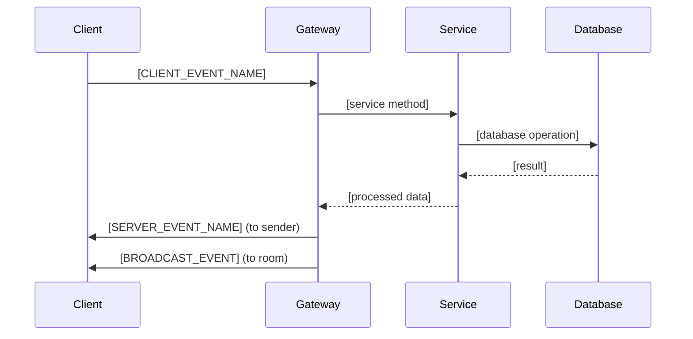

# [FeatureName] WebSocket Events

> **Gateway:** `backend/src/[path]/[feature].gateway.ts`  
> **Client Events:** `frontend/src/types/websocket/[feature]Events.ts`  
> **Domain:** [auth | community | messages | presence | rooms]

## Overview

[Brief description of what real-time events this feature handles and why WebSocket communication is needed]

## Gateway Configuration

```typescript
@WebSocketGateway({
  cors: {
    origin: process.env.CORS_ORIGIN?.split(',') || ['http://localhost:5173'],
    credentials: true,
  },
  namespace: '/[namespace]', // Optional namespace
})
export class [Feature]Gateway implements OnGatewayConnection, OnGatewayDisconnect {
  // [Implementation details]
}
```

## Event Categories

### Client → Server Events

Events sent from the frontend to the backend.

#### [CLIENT_EVENT_NAME]

**Event:** `[CLIENT_EVENT_NAME]`  
**Purpose:** [What this event accomplishes]  
**Authentication:** [Required | Optional | None]  
**RBAC Required:** `[PERMISSION_NAME]` (if applicable)

##### Payload Structure

```typescript
interface [ClientEvent]Payload {
  [field]: [type];          // [description and validation rules]
  [optionalField]?: [type]; // [optional field description]
  [metadata]: [type];       // [additional context]
}
```

##### Handler Implementation

```typescript
@SubscribeMessage(ClientEvents.[CLIENT_EVENT_NAME])
@RequiredActions(RbacActions.[PERMISSION_NAME]) // If RBAC required
@RbacResource({
  type: RbacResourceType.[RESOURCE_TYPE],
  idKey: '[resourceField]',
  source: ResourceIdSource.PAYLOAD,
})
async handle[EventName](
  @ConnectedSocket() client: AuthenticatedSocket,
  @MessageBody() payload: [ClientEvent]Payload,
): Promise<void> {
  try {
    // [Event processing logic]
    const result = await this.[service].[method](payload);
    
    // [Emit response or broadcast to other clients]
    this.websocketService.sendToRoom(
      [roomId],
      ServerEvents.[SERVER_EVENT_NAME],
      result
    );
  } catch (error) {
    // [Error handling and error event emission]
    client.emit(ServerEvents.ERROR, {
      event: ClientEvents.[CLIENT_EVENT_NAME],
      message: error.message,
    });
  }
}
```

##### Frontend Usage

```typescript
import { useWebSocket } from '@/hooks/useWebSocket';
import { ClientEvents } from '@/types/websocket/events';

function [Component]() {
  const socket = useWebSocket();

  const handle[Action] = ([data]: [ClientEvent]Payload) => {
    socket.emit(ClientEvents.[CLIENT_EVENT_NAME], [data]);
  };

  return (
    <button onClick={() => handle[Action]([exampleData])}>
      [Action Label]
    </button>
  );
}
```

---

### Server → Client Events

Events sent from the backend to the frontend.

#### [SERVER_EVENT_NAME]

**Event:** `[SERVER_EVENT_NAME]`  
**Purpose:** [What this event notifies the client about]  
**Scope:** [User-specific | Room-specific | Global broadcast]  
**Trigger:** [What backend action causes this event]

##### Payload Structure

```typescript
interface [ServerEvent]Payload {
  [dataField]: [type];      // [main data being sent]
  [metadata]: [type];       // [additional context]
  [timestamp]: string;      // [when the event occurred]
  [userId]?: string;        // [user context if relevant]
}
```

##### Backend Emission

```typescript
// Room-specific broadcast
this.websocketService.sendToRoom(
  [roomId],
  ServerEvents.[SERVER_EVENT_NAME],
  [payload]
);

// User-specific send
this.websocketService.sendToUser(
  [userId],
  ServerEvents.[SERVER_EVENT_NAME], 
  [payload]
);

// Global broadcast
this.websocketService.broadcast(
  ServerEvents.[SERVER_EVENT_NAME],
  [payload]
);
```

##### Frontend Handling

```typescript
import { useWebSocketEvent } from '@/hooks/useWebSocketEvent';
import { ServerEvents } from '@/types/websocket/events';

function [Component]() {
  useWebSocketEvent(ServerEvents.[SERVER_EVENT_NAME], ([data]: [ServerEvent]Payload) => {
    // [Handle the incoming event]
    console.log('Received [event description]:', [data]);
    
    // [Update local state, show notifications, etc.]
  });

  return (
    // [Component JSX]
  );
}
```

---

## Room Management

### Room Joining

```typescript
// Join a room (typically done on connection or route change)
@SubscribeMessage(ClientEvents.JOIN_[ROOM_TYPE])
async handleJoin[RoomType](
  @ConnectedSocket() client: AuthenticatedSocket,
  @MessageBody() { [roomId] }: { [roomId]: string },
): Promise<void> {
  // [Permission checks]
  const hasAccess = await this.[service].checkAccess(client.user.id, [roomId]);
  if (!hasAccess) {
    throw new UnauthorizedException('Access denied to [room type]');
  }

  // Join the room
  await client.join([roomId]);
  
  // Notify others in the room
  client.to([roomId]).emit(ServerEvents.USER_JOINED_[ROOM_TYPE], {
    userId: client.user.id,
    username: client.user.username,
    [roomId]: [roomId],
  });
}
```

### Room Leaving

```typescript
@SubscribeMessage(ClientEvents.LEAVE_[ROOM_TYPE])
async handleLeave[RoomType](
  @ConnectedSocket() client: AuthenticatedSocket,
  @MessageBody() { [roomId] }: { [roomId]: string },
): Promise<void> {
  await client.leave([roomId]);
  
  // Notify others in the room
  client.to([roomId]).emit(ServerEvents.USER_LEFT_[ROOM_TYPE], {
    userId: client.user.id,
    [roomId]: [roomId],
  });
}
```

## Connection Lifecycle

### Connection Handler

```typescript
async handleConnection(client: AuthenticatedSocket): Promise<void> {
  try {
    // [Authentication and user setup]
    const user = await this.authService.validateSocketToken(client.handshake.auth.token);
    client.user = user;
    
    // [Join default rooms or perform setup]
    await this.[setupMethod](client);
    
    // [Emit connection success]
    client.emit(ServerEvents.CONNECTION_SUCCESS, {
      message: 'Connected to [feature] gateway',
      user: user,
    });
  } catch (error) {
    client.emit(ServerEvents.CONNECTION_ERROR, {
      message: 'Authentication failed',
    });
    client.disconnect();
  }
}
```

### Disconnection Handler

```typescript
async handleDisconnect(client: AuthenticatedSocket): Promise<void> {
  if (client.user) {
    // [Cleanup operations]
    await this.[cleanupMethod](client);
    
    // [Notify relevant rooms about disconnection]
    this.websocketService.broadcast(ServerEvents.USER_DISCONNECTED, {
      userId: client.user.id,
    });
  }
}
```

## Error Handling

### Error Event Structure

```typescript
interface WebSocketError {
  event: string;           // The original event that caused the error
  message: string;         // Human-readable error message
  code?: string;           // Error code for programmatic handling
  details?: any;           // Additional error context
}
```

### Common Error Patterns

```typescript
// Permission errors
client.emit(ServerEvents.ERROR, {
  event: originalEvent,
  message: 'Insufficient permissions',
  code: 'PERMISSION_DENIED',
});

// Validation errors
client.emit(ServerEvents.ERROR, {
  event: originalEvent,
  message: 'Invalid payload format',
  code: 'VALIDATION_ERROR',
  details: validationErrors,
});

// Resource not found
client.emit(ServerEvents.ERROR, {
  event: originalEvent,
  message: '[Resource] not found',
  code: 'NOT_FOUND',
});
```

## Rate Limiting

[If rate limiting is implemented]

```typescript
// Rate limiting configuration
@UseGuards(ThrottlerGuard)
@Throttle(5, 60) // 5 requests per 60 seconds
@SubscribeMessage(ClientEvents.[EVENT_NAME])
async handle[Event](...): Promise<void> {
  // [Event handler]
}
```

## Testing WebSocket Events

### Gateway Testing

```typescript
import { Test, TestingModule } from '@nestjs/testing';
import { [Feature]Gateway } from '../[feature].gateway';

describe('[Feature]Gateway', () => {
  let gateway: [Feature]Gateway;
  let mockSocket: any;

  beforeEach(async () => {
    const module: TestingModule = await Test.createTestingModule({
      providers: [[Feature]Gateway, /* other providers */],
    }).compile();

    gateway = module.get<[Feature]Gateway>([Feature]Gateway);
    
    mockSocket = {
      id: 'test-socket-id',
      user: { id: 'user-1', username: 'testuser' },
      emit: jest.fn(),
      join: jest.fn(),
      leave: jest.fn(),
      to: jest.fn(() => ({ emit: jest.fn() })),
    };
  });

  it('should handle [CLIENT_EVENT_NAME]', async () => {
    const payload = { [testField]: '[testValue]' };
    
    await gateway.handle[EventName](mockSocket, payload);
    
    expect(mockSocket.emit).toHaveBeenCalledWith(
      ServerEvents.[RESPONSE_EVENT],
      expect.objectContaining([expectedResponse])
    );
  });
});
```

### Frontend Testing

```typescript
import { render, screen } from '@testing-library/react';
import { MockedProvider } from '@/test-utils/MockedWebSocketProvider';
import { [Component] } from '../[Component]';

test('should handle [SERVER_EVENT_NAME]', async () => {
  const mockEmit = jest.fn();
  
  render(
    <MockedProvider mockEmit={mockEmit}>
      <[Component] />
    </MockedProvider>
  );
  
  // Simulate server event
  MockedProvider.emitEvent(ServerEvents.[SERVER_EVENT_NAME], [testPayload]);
  
  // Assert UI updates
  expect(screen.getByText('[expected text]')).toBeInTheDocument();
});
```

## Event Flow Examples

### Example 1: [Use Case Name]



### Example 2: [Another Use Case]

[Detailed step-by-step flow description]

1. Client emits `[CLIENT_EVENT]` with [payload description]
2. Gateway validates [what is validated]
3. Service performs [business logic]
4. Database [data operation]
5. Gateway broadcasts `[SERVER_EVENT]` to [target audience]
6. Clients update [what gets updated]

## Performance Considerations

### Scalability

- **Redis Adapter:** Uses Redis for multi-instance scaling
- **Room Size Limits:** [any limits on room participants]
- **Event Throttling:** [rate limiting on high-frequency events]

### Memory Management

- **Connection Cleanup:** [how connections are cleaned up]
- **Room Management:** [how empty rooms are handled]
- **Message Queuing:** [if offline message queuing exists]

## Troubleshooting

### Common Issues

1. **Connection Failures**
   - **Cause:** [common causes]
   - **Solution:** [debugging steps]
   - **Prevention:** [how to avoid]

2. **Event Not Received**
   - **Cause:** [why events might not arrive]
   - **Solution:** [troubleshooting steps]
   - **Prevention:** [best practices]

3. **Performance Issues**
   - **Symptoms:** [how to identify]
   - **Cause:** [common performance bottlenecks]
   - **Solution:** [optimization strategies]

### Debugging Tools

```typescript
// Enable WebSocket debugging
localStorage.debug = 'socket.io-client:socket';

// Monitor events in development
if (process.env.NODE_ENV === 'development') {
  socket.onAny((eventName, ...args) => {
    console.log('WebSocket event:', eventName, args);
  });
}
```

## Related Documentation

- [Module Documentation](../modules/[related-module].md)
- [API Endpoints](../api/[related-api].md)
- [Frontend Integration](../components/[websocket-components].md)
- [Authentication](../features/auth-rbac.md)